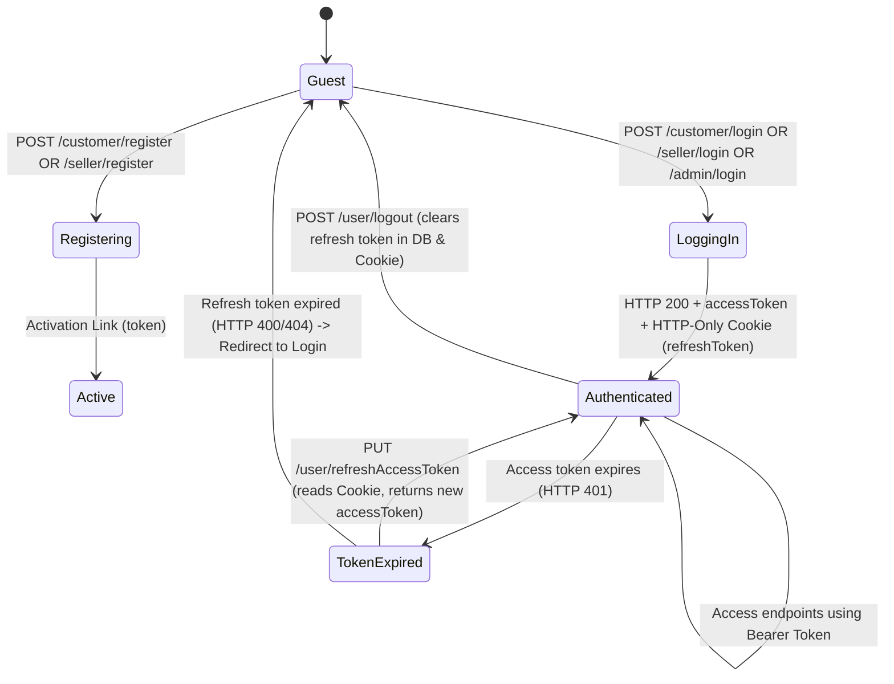
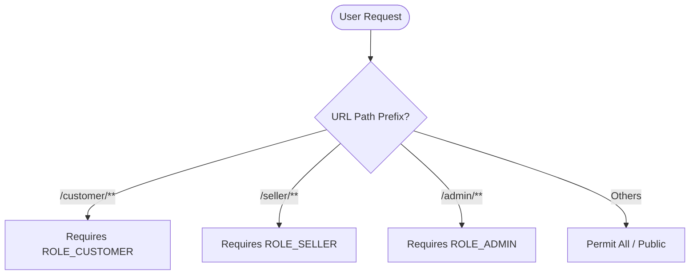

# Frontend Integration Guide: TTN E-Commerce Backend

This document provides a comprehensive overview of the REST API backend endpoints, request payloads, response payloads, authentication flows, validation rules, and other integration details to facilitate building the frontend application.

---

## 1. Project Overview & Configuration

### Base Server URL
By default, the Spring Boot application runs on port `8080`.
*   **Base URL**: `http://localhost:8080`

### CORS Management
> [!WARNING]
> The backend does not have a global CORS configuration in `SecurityConfig.java`. To avoid **CORS (Cross-Origin Resource Sharing)** issues during local development, the frontend developer should use one of the following approaches:
> 1.  **Configure a Reverse Proxy**: In Vite, Webpack, or Next.js, configure the local development server to proxy requests from `/api` (or similar) to `http://localhost:8080`.
> 2.  **Add CORS to Spring Boot**: Add a `@CrossOrigin` annotation on controllers or define a global CORS filter bean.

---

## 2. Authentication & Session Flow

The application uses **JWT (JSON Web Token)** for authentication:
1.  **Access Token**: Passed as a Bearer token in the `Authorization` header (`Authorization: Bearer <token>`). Expires in **300 minutes** (5 hours).
2.  **Refresh Token**: Automatically set by the backend as an **HTTP-only Cookie** named `refreshToken`. Expires in **24 hours**.

### Authentication State Machine



---

## 3. General & Shared API Endpoints

### 3.1. Account Activation
After registration, accounts (specifically customers) receive an email containing an activation token.
*   **Route**: `PUT /activate`
*   **Query Parameters**:
    *   `token` (String, Required): The token sent via email.
*   **Response**: `HTTP 200 OK` on success.

### 3.2. Resend Activation Token
If the activation token expires or is lost.
*   **Route**: `POST /resendToken`
*   **Content-Type**: `application/json`
*   **Request Body**:
    ```json
    {
      "email": "user@example.com",
      "role": "CUSTOMER" // Or "SELLER", "ADMIN"
    }
    ```
*   **Response**: `HTTP 200 OK` on success.

### 3.3. Refresh Access Token
Used when the access token has expired (the API returns a `401 Unauthorized` with message `"Access token expired"`).
*   **Route**: `PUT /user/refreshAccessToken`
*   **Headers**: None (reads the HTTP-Only `refreshToken` cookie automatically).
*   **Response**:
    ```json
    {
      "accessToken": "new_jwt_access_token_here"
    }
    ```

### 3.4. Forgot / Reset Password Flow
1.  **Request Password Reset**:
    *   **Route**: `POST /reset-password/newPassword`
    *   **Query Parameters**:
        *   `email` (String, Required)
        *   `role` (RoleType: `CUSTOMER` | `SELLER` | `ADMIN`, Required)
    *   **Response**: Sends reset link/token email.
2.  **Confirm Password Reset**:
    *   **Route**: `PATCH /reset-password/changePassword`
    *   **Query Parameters**:
        *   `token` (String, Required): Token from reset email.
    *   **Request Body (`ResetPasswordDTO`)**:
        ```json
        {
          "password": "NewSecurePassword@123",
          "confirmPassword": "NewSecurePassword@123"
        }
        ```
    *   **Response**: Password updated notification.

---

## 4. Role-Specific Integration Panels

The system has three security roles defined in the backend: `CUSTOMER`, `SELLER`, and `ADMIN`.



---

## 5. Customer Panel (`/customer/**`)

All customer endpoints require `Authorization: Bearer <accessToken>` and the user must have the `ROLE_CUSTOMER` role.

### 5.1. Authentication & Profile
*   **Register**: `POST /customer/register` (Public)
    *   **Request Body (`CustomerDTO`)**:
        ```json
        {
          "email": "customer@example.com",
          "password": "Password@1234",
          "confirmPassword": "Password@1234",
          "firstName": "John",
          "middleName": "Robert", // Optional
          "lastName": "Doe",
          "contact": "9876543210"
        }
        ```
*   **Login**: `POST /customer/login` (Public)
    *   **Request Body (`LoginDTO`)**:
        ```json
        {
          "email": "customer@example.com",
          "password": "Password@1234"
        }
        ```
    *   **Response**: `{"accessToken": "..."}` + HTTP-Only Cookie `refreshToken`.
*   **Logout**: `POST /customer/logout`
    *   **Response**: HTTP 200 OK.
*   **Get Profile**: `GET /customer/profile`
    *   **Response (`CustomerProfileDTO`)**:
        ```json
        {
          "id": "customer-user-uuid",
          "firstName": "John",
          "middleName": "Robert",
          "lastName": "Doe",
          "contact": "9876543210",
          "image": "uploads/users/customer-user-uuid.png", // Null if not uploaded
          "active": true
        }
        ```
*   **Update Profile**: `PATCH /customer/profile`
    *   **Request Body (`CustomerUpdateprofileDTO`)** (All fields are optional for partial updates):
        ```json
        {
          "firstName": "Johnny",
          "middleName": "R.",
          "lastName": "Doe",
          "contact": "9999999999"
        }
        ```
*   **Update Password**: `PATCH /customer/updatePassword`
    *   **Request Body (`ChangePasswordDTO`)**:
        ```json
        {
          "prevPassword": "Password@1234",
          "password": "NewPassword@1234",
          "confirmPAssword": "NewPassword@1234" // Note: Capital 'A' in confirmPAssword!
        }
        ```

### 5.2. Profile Image
*   **Upload Profile Image**: `POST /customer/profile/image`
    *   **Content-Type**: `multipart/form-data`
    *   **Payload**: File field named `"image"`.
*   **View Profile Image**: `GET /customer/profile/image`
    *   **Response**: Image stream bytes.

### 5.3. Address Management
*   **List Addresses**: `GET /customer/addresses`
    *   **Response**: `List<AddressDTO>` (Refer to Address schemas in Section 8).
*   **Add Address**: `POST /customer/address`
    *   **Request Body (`AddressDTO`)**:
        ```json
        {
          "city": "New Delhi",
          "state": "Delhi",
          "country": "India",
          "addressLine": "123, Ring Road, Lajpat Nagar",
          "zipCode": "110024",
          "label": "HOME" // Must be HOME, OFFICE, or OTHER
        }
        ```
*   **Update Address**: `PATCH /customer/address/{addressId}`
    *   **Request Body (`UpdateAddressDTO`)** (All fields optional):
        ```json
        {
          "city": "South Delhi",
          "addressLine": "456, Ring Road, Lajpat Nagar",
          "zipCode": "110024",
          "label": "OFFICE"
        }
        ```
*   **Delete Address**: `DELETE /customer/address/{addressId}`

### 5.4. Category Views
*   **List Subcategories**: `GET /customer/categories`
    *   **Query Parameters**:
        *   `categoryId` (UUID, Optional): If omitted, retrieves root categories. If provided, retrieves children.
*   **Get Category Filters**: `GET /customer/categories/filter-details`
    *   **Query Parameters**:
        *   `categoryId` (UUID, Required): Leaf category ID.
    *   **Response (`CategoryFilterDetailsDTO`)**:
        ```json
        {
          "categoryId": "category-uuid",
          "categoryName": "Smartphones",
          "metadataFields": [
            {
              "fieldId": "field-uuid",
              "fieldName": "RAM",
              "possibleValues": "4GB,6GB,8GB,12GB"
            }
          ],
          "brands": ["Apple", "Samsung", "OnePlus"],
          "minPrice": 10000.0,
          "maxPrice": 150000.0
        }
        ```

### 5.5. Product Catalog Browsing
*   **View All Products in Category**: `GET /customer/products`
    *   **Query Parameters**:
        *   `categoryId` (UUID, Required)
        *   `max` (int, Optional, Default: 10): Page size.
        *   `offset` (int, Optional, Default: 0): Page number.
        *   `sortBy` (String, Optional, Default: "name"): Allowed: `id`, `name`, `brand`.
        *   `order` (String, Optional, Default: "asc"): `asc` | `desc`.
    *   **Response**: Contains metadata, page metrics, and a list of product summaries.
*   **View Specific Product Details**: `GET /customer/products/{productId}`
    *   **Response**: Detailed product structure with all active variations, images, prices, and JSON metadata.
*   **View Similar Products**: `GET /customer/products/{productId}/similar`
    *   **Query Parameters**: `max` (Default: 10), `offset` (Default: 0), `sortBy` (Default: "name"), `order` (Default: "asc").

---

## 6. Seller Panel (`/seller/**`)

All seller endpoints require `Authorization: Bearer <accessToken>` and the user must have the `ROLE_SELLER` role.

### 6.1. Registration & Profile
*   **Register**: `POST /seller/register` (Public)
    *   **Request Body (`SellerDTO`)**:
        ```json
        {
          "email": "seller@company.com",
          "password": "SellerPassword@1234",
          "confirmPassword": "SellerPassword@1234",
          "firstName": "John",
          "middleName": "R.", // Optional
          "lastName": "Smith",
          "companyName": "Alpha Retailers Pvt Ltd",
          "companyContact": "9876543211",
          "gst": "07AAAAA1111A1Z1", // GST validation details in section 8
          "address": {
            "city": "Mumbai",
            "state": "Maharashtra",
            "country": "India",
            "addressLine": "Building 5A, Bandra Kurla Complex",
            "zipCode": "400051",
            "label": "OFFICE"
          }
        }
        ```
*   **Login**: `POST /seller/login` (Public)
    *   **Request Body (`LoginDTO`)**: Same structure as customer.
*   **Logout**: `POST /seller/logout`
*   **Get Profile**: `GET /seller/profile`
    *   **Response (`SellerProfileDTO`)** (Refer to schemas in Section 8).
*   **Update Profile**: `PATCH /seller/profile`
    *   **Request Body (`SellerUpdateProfileDTO`)** (All fields optional):
        ```json
        {
          "firstName": "Johnny",
          "companyName": "Beta Retailers Pvt Ltd",
          "companyContact": "9822334455",
          "gst": "07BBBBB2222B2Z2"
        }
        ```
*   **Update Password**: `PATCH /seller/password`
    *   **Request Body (`ChangePasswordDTO`)**: Same structure as customer.
*   **Update Address**: `PUT /seller/changeAddress/{id}`
    *   **Request Body (`UpdateAddressDTO`)** (All fields optional).

### 6.2. Categories View
*   **List Leaf Categories**: `GET /seller/categories`
    *   **Response**: List of leaf-level categories available for sellers to attach products to.

### 6.3. Product Management
*   **Add Product**: `POST /seller/products`
    *   **Request Body (`AddProductDTO`)**:
        ```json
        {
          "name": "Galaxy S24 Ultra",
          "brand": "Samsung",
          "categoryId": "leaf-category-uuid",
          "description": "Latest flagship smartphone from Samsung",
          "isCancellable": true, // Default: false
          "isReturnable": true   // Default: false
        }
        ```
    *   *Note: Products created by sellers are inactive by default and require Admin approval.*
*   **Update Product**: `PUT /seller/products/{productId}`
    *   **Request Body (`UpdateProductDTO`)** (All fields optional):
        ```json
        {
          "name": "Galaxy S24 Ultra Edition",
          "description": "Updated product description",
          "isCancellable": false,
          "isReturnable": false
        }
        ```
*   **Delete Product**: `DELETE /seller/products/{productId}`
*   **List Seller Products**: `GET /seller/products`
    *   **Query Parameters**:
        *   `max` (Default: 10), `offset` (Default: 0), `sortBy` (Default: "name"), `order` (Default: "asc")
        *   `query` (String, Optional): Free-text filter on name/brand.
        *   `productId` (UUID, Optional): Specific product.

### 6.4. Product Variation Management
Product variations (e.g. different colors, storage, sizes) are added and updated using **Multipart Form Data** because they require uploading image assets.

*   **Add Product Variation**: `POST /seller/products/variations`
    *   **Content-Type**: `multipart/form-data`
    *   **Request Parameters**:
        *   `data` (Form Parameter - String, Required): Stringified JSON matching the structure of `AddProductVariationDTO`.
            *   *Example Stringified JSON*:
                ```json
                {
                  "productId": "product-uuid",
                  "quantityAvailable": 15,
                  "price": 124999.0,
                  "metadata": {
                    "color": "Titanium Gray",
                    "storage": "512GB"
                  }
                }
                ```
        *   `primaryImage` (File Part, Required): The main image for the variation.
        *   `secondaryImages` (File Part Array, Optional): Additional images.
*   **Update Product Variation**: `PUT /seller/products/variations/{variationId}`
    *   **Content-Type**: `multipart/form-data`
    *   **Request Parameters**:
        *   `data` (Form Parameter - String, Required): Stringified JSON matching the structure of `UpdateProductVariationDTO` (All fields optional).
            *   *Example Stringified JSON*:
                ```json
                {
                  "quantityAvailable": 25,
                  "price": 119999.0,
                  "metadata": {
                    "color": "Titanium Black",
                    "storage": "512GB"
                  },
                  "isActive": true
                }
                ```
        *   `primaryImage` (File Part, Optional): Updates the main image.
        *   `secondaryImages` (File Part Array, Optional): Updates/overrides secondary images.
*   **List Variations**: `GET /seller/products/variations`
    *   **Query Parameters**:
        *   `productId` (UUID, Required)
        *   `variationId` (UUID, Optional)
        *   `max` (Default: 10), `offset` (Default: 0), `sortBy` (Default: "id"), `order` (Default: "asc")

---

## 7. Admin Panel (`/admin/**`)

All admin endpoints require `Authorization: Bearer <accessToken>` and the user must have the `ROLE_ADMIN` role.

### 7.1. Authentication & System Dashboard
*   **Login**: `POST /admin/login` (Public)
    *   **Request Body (`LoginDTO`)**: Same structure as customer.
*   **Logout**: `POST /admin/logout`
*   **List Customers**: `GET /admin/customers`
    *   **Query Parameters**: `pageSize` (Default: 10), `pageOffset` (Default: 0), `sortBy` (Default: "id"), `order` (Default: "asc"), `email` (Optional).
*   **List Sellers**: `GET /admin/sellers`
    *   **Query Parameters**: `pageSize` (Default: 10), `pageOffset` (Default: 0), `sortBy` (Default: "id"), `order` (Default: "asc"), `email` (Optional).
*   **Toggle Customer Activation**:
    *   Activate: `PATCH /admin/customer/{id}/activate`
    *   Deactivate: `PATCH /admin/customer/{id}/deactivate`
*   **Toggle Seller Activation**:
    *   Activate: `PATCH /admin/seller/{id}/activate`
    *   Deactivate: `PATCH /admin/seller/{id}/deactivate`

### 7.2. Product Activation
*   **List Products**: `GET /admin/products`
    *   **Query Parameters**: `max` (Default: 10), `offset` (Default: 0), `sortBy` (Default: "name"), `order` (Default: "asc"), `sellerId` (Optional), `categoryId` (Optional), `productId` (Optional).
*   **Activate Product**: `PUT /admin/products/{productId}/activate`
*   **Deactivate Product**: `PUT /admin/products/{productId}/deactivate`

### 7.3. Category Configuration
*   **Add Category**: `POST /admin/categories`
    *   **Request Body (`CategoryDTO`)**:
        ```json
        {
          "name": "Electronics",
          "parentCategory": null // Or UUID of parent category
        }
        ```
*   **Update Category**: `PUT /admin/categories`
    *   **Request Body (`CategoryUpdateDTO`)**:
        ```json
        {
          "id": "category-uuid",
          "name": "Consumer Electronics"
        }
        ```
*   **List All Categories**: `GET /admin/categories`
    *   **Query Parameters**: `max`, `offset`, `sortBy`, `order`, `query`, `categoryId` (Optional).

### 7.4. Metadata Fields Definition
Metadata fields represent keys like "RAM", "Screen Size", "Processor", etc., that can be bound to category products for filtering.
*   **Add Metadata Field Key**: `POST /admin/metadata-fields`
    *   **Request Body (`MetadataFieldDTO`)**:
        ```json
        {
          "name": "Color"
        }
        ```
*   **List Metadata Field Keys**: `GET /admin/metadata-fields`
    *   **Query Parameters**: `max`, `offset`, `sortBy`, `order`, `query`.
*   **Assign Fields and Values to Category**: `POST /admin/categories/metadata-fields`
    *   **Request Body (`CategoryMetadataFieldsRequestDTO`)**:
        ```json
        {
          "categoryId": "category-uuid",
          "fields": [
            {
              "fieldId": "metadata-field-key-uuid",
              "values": ["Titanium Gray", "Titanium Black", "Titanium Violet"]
            }
          ]
        }
        ```

---

## 8. Request Schemas & Client-Side Validation Rules

To prevent unnecessary API calls and improve user experience, enforce the following validation constraints in the frontend application forms.

### 8.1. Common Regex Patterns
*   **Password Constraint**: Must contain at least one lowercase letter, one uppercase letter, one digit, and one special character.
    *   **Length**: 8 to 15 characters.
    *   **Pattern**: `^(?=.*[a-z])(?=.*[A-Z])(?=.*\d)(?=.*[^A-Za-z\d]).{8,15}$`
*   **Phone Number**: Indian standard mobile number formatting.
    *   **Pattern**: `^[6-9]\d{9}$`
*   **GST Identification Number**:
    *   **Pattern**: `^[0-9]{2}[A-Z]{5}[0-9]{4}[A-Z]{1}[A-Z0-9]{3}$`

### 8.2. DTO Specifications

#### AddressDTO
| Field | Type | Required | Validation Rules |
| :--- | :--- | :---: | :--- |
| `id` | UUID | No | Automatically populated by backend. |
| `city` | String | Yes | Cannot be blank. |
| `state` | String | Yes | Cannot be blank. |
| `country` | String | Yes | Cannot be blank. |
| `addressLine` | String | Yes | Cannot be blank. |
| `zipCode` | String | Yes | Cannot be blank. |
| `label` | String | Yes | Must match: `HOME` or `OFFICE` or `OTHER`. |

#### SellerProfileDTO (Response Schema)
```json
{
  "id": "seller-user-uuid",
  "firstName": "John",
  "middleName": "R.",
  "lastName": "Smith",
  "active": true,
  "companyContact": "9876543211",
  "companyName": "Alpha Retailers Pvt Ltd",
  "gst": "07AAAAA1111A1Z1",
  "address": {
    "id": "address-uuid",
    "city": "Mumbai",
    "state": "Maharashtra",
    "country": "India",
    "addressLine": "Building 5A, BKC",
    "zipCode": "400051",
    "label": "OFFICE"
  },
  "image": "uploads/users/seller-user-uuid.jpg" // Null if not set
}
```

#### Upload Image Rules (Profile & Variation Images)
*   **Supported MIME Types**: `image/jpeg`, `image/jpg`, `image/png`, `image/bmp`
*   **Max Request / File Size**: `5MB`

---

## 9. API Response & Error Handling Standards

### 9.1. Success Response Envelope
All operations return standard responses. Many retrieve actions pack the model inside a data envelope wrapper:
```json
{
  "message": "Operation description / Success status",
  "data": {
    // Model payload or List values here
  }
}
```

### 9.2. Exception Handling Map

The backend throws structured JSON responses on errors, which the frontend should intercept and display to users.

#### 400 Bad Request (Validation Errors)
Occurs when the request body fields fail validation checks (e.g. invalid password structure or missing mandatory fields).
```json
{
  "timestamp": "2026-06-24T00:30:15.123456",
  "status": 400,
  "error": "Bad Request",
  "message": {
    "password": "Password must be 8-15 chars with upper, lower, number & special char",
    "email": "must be a well-formed email address"
  },
  "path": "/customer/register"
}
```

#### 401 Unauthorized
Occurs when the token is missing, expired, or invalid.
```json
{
  "error": "Access token expired" // Or "Unauthorized - Please login to access this resource"
}
```
*   **Action**: Try calling `PUT /user/refreshAccessToken` to fetch a new token. If that fails, clear authorization state and redirect to `/login`.

#### 403 Forbidden
Occurs when the logged-in user does not have the authority required for the endpoint.
```json
{
  "error": "Forbidden - You do not have permission to access this resource"
}
```
*   **Action**: Redirect to the user's home dashboard corresponding to their role.

#### 404 Not Found
Occurs when resources are deleted, active variations are missing, or a query fails.
```json
{
  "timestamp": "2026-06-24T00:35:42.987654",
  "status": 404,
  "error": "Not Found",
  "message": "Product not found with id: product-uuid",
  "path": "/customer/products/product-uuid"
}
```
